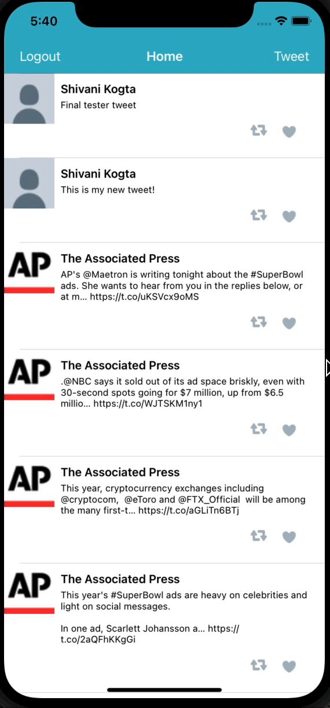

# Twitter

This is a basic **Twitter** app to view, compose, favorite, and retweet tweets.

## User Stories

The following functionality is complete:

- [x] User sees app icon in home screen and styled launch screen.
- [x] User can log in.
- [x] User can log out.
- [x] User stays logged in across restarts.
- [x] User can view tweets with the user profile picture, username, and tweet text.
- [x] User can compose a tweet.
- [x] User can favorite a tweet.
- [x] User can retweet a tweet.

## App Walkthrough GIF

Here's a walkthrough of the implemented user stories:

